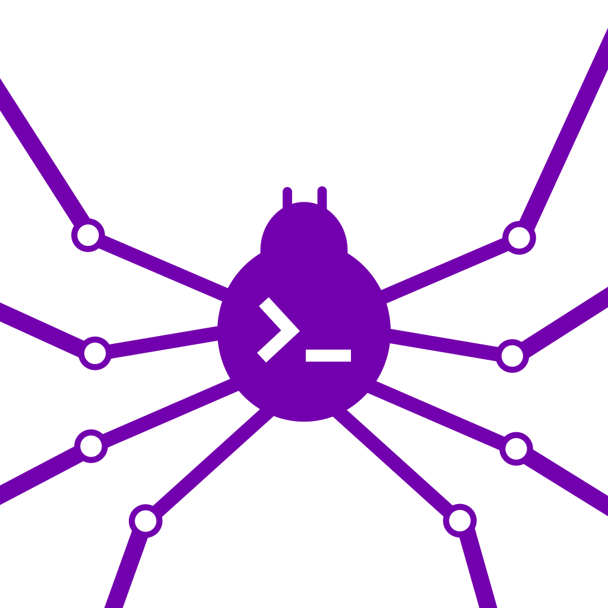

<a id="readme-top"></a>

<div align="center">



# SSHWeaver

**A modern, fast and secure SSH and SFTP client for the desktop.**

[Report a Bug](https://github.com/ErwanHeschung/SSHWeaver/issues)
·
[Request a Feature](https://github.com/ErwanHeschung/SSHWeaver/issues)

<br />

[](https://tauri.app)
[](https://react.dev)
[](https://www.typescriptlang.org)
[](https://www.rust-lang.org)
[](https://www.sqlite.org)
[](https://tailwindcss.com)

[](https://github.com/ErwanHeschung/SSHWeaver/actions/workflows/ci.yml)
[](#getting-started)
[](https://github.com/ErwanHeschung/SSHWeaver/stargazers)
[](https://github.com/ErwanHeschung/SSHWeaver/issues)
[](LICENSE)

</div>

## Table of Contents

- [About The Project](#about-the-project)
- [Built With](#built-with)
- [Getting Started](#getting-started)
- [Usage](#usage)
- [Testing](#testing)
- [Architecture](#architecture)
- [Security](#security)
- [Roadmap](#roadmap)
- [Contributing](#contributing)
- [License](#license)
- [Contact](#contact)
- [Acknowledgments](#acknowledgments)

## About The Project

SSHWeaver is a desktop SSH and SFTP client built with Tauri and Rust. It pairs a
native, memory-safe backend (real SSH transport via [`russh`](https://github.com/Eugeny/russh))
with a responsive React interface, so you get the performance and security of a
native application together with a polished, modern user experience.

Key capabilities:

- **Full SSH terminal.** Real PTY sessions powered by `russh` and rendered with a
  WebGL-accelerated [xterm.js](https://xtermjs.org/) terminal, with support for
  multiple concurrent tabs.
- **Integrated SFTP browser.** Browse, upload (including drag and drop), download,
  delete and preview remote files without leaving the application.
- **Flexible authentication.** `ssh-agent`, default `~/.ssh` keys, and password
  authentication, attempted automatically in that order.
- **Host key verification.** Trust on first use with fingerprint confirmation,
  changed-key detection, and an interoperable `~/.ssh/known_hosts` written atomically.
- **Secure secret storage.** Passwords are stored in the operating system keychain
  (Windows Credential Manager, macOS Keychain, Linux Secret Service), never in plaintext.
- **Connection management.** Saved connections with favorites and instant search,
  persisted in a local SQLite database.
- **Internationalization.** English and French out of the box, with type-safe translation keys.
- **Theming.** Light, dark and system modes.

<p align="right">(<a href="#readme-top">back to top</a>)</p>

## Built With

| Layer | Technologies |
|------|--------------|
| Frontend | React 19, TypeScript, Tailwind CSS 4, Zustand, React Router, xterm.js |
| Backend | Rust, Tauri 2, `russh` and `russh-sftp`, `rusqlite`, `keyring`, `tokio` |
| Tooling | Vite, `tauri-specta` (type-safe IPC bindings), `rusqlite_migration` |

<p align="right">(<a href="#readme-top">back to top</a>)</p>

## Getting Started

Follow these steps to get a local development build running.

### Prerequisites

- [Node.js](https://nodejs.org/) with [pnpm](https://pnpm.io/)
- [Rust](https://www.rust-lang.org/tools/install) (stable toolchain)
- Platform dependencies for Tauri, listed in the [Tauri prerequisites guide](https://tauri.app/start/prerequisites/)

### Installation

```bash
git clone https://github.com/ErwanHeschung/SSHWeaver.git
cd SSHWeaver
pnpm install
```

### Development

```bash
pnpm tauri dev
```

### Production build

```bash
pnpm tauri build
```

Packaged installers are written to `src-tauri/target/release/bundle/`.

<p align="right">(<a href="#readme-top">back to top</a>)</p>

## Usage

1. Launch the application and add a connection with its host, port and username.
2. Connect. SSHWeaver tries `ssh-agent`, then your default `~/.ssh` keys, then
   prompts for a password if needed. New host keys must be confirmed once.
3. Work in the terminal tab, or switch to the file browser to manage remote files
   over SFTP.
4. Optionally save the password to your operating system keychain for future use.

<p align="right">(<a href="#readme-top">back to top</a>)</p>

## Testing

The Rust backend is covered by an automated test suite that runs against in-memory
SQLite and temporary directories, requiring no network access.

```bash
cargo test --manifest-path src-tauri/Cargo.toml
```

| Area | What is covered |
|------|----------------|
| Connections store | CRUD operations, name ordering, duplicate-endpoint constraint |
| Migrations | Schema validity and full up and down reversibility |
| Error handling | Internal SQL errors are sanitized before reaching the UI |
| Host keys | `known_hosts` atomic writes and key-line matching |
| SFTP | Remote path joining |

Tests run on every push through GitHub Actions, and the badge at the top reflects
the current number of passing tests.

### Coverage

```bash
cargo install cargo-llvm-cov
cargo llvm-cov --manifest-path src-tauri/Cargo.toml --open
```

<p align="right">(<a href="#readme-top">back to top</a>)</p>

## Architecture

```
SSHWeaver/
  src/                     React frontend
    components/            UI (Terminal, Sftp, ConnectionList, Modal, Settings)
    screens/               Top-level screens
    layouts/               Shared layout shells
    stores/                Zustand state stores
    repositories/          Typed wrappers over Tauri IPC commands
    hooks/                 Reusable React hooks
    services/              Browser-side services (storage, etc.)
    theme/                 Theming context
    i18n/                  Localization (en, fr)
    types/                 Shared TypeScript types
  src-tauri/               Rust backend
    src/
      features/
        ssh/               SSH sessions and SFTP
        connections/       Saved connections (store and commands)
        secrets/           OS keychain integration
      db/                  SQLite setup and migrations
      ipc.rs               Tauri command and event registration
      lib.rs               Application entry point
    migrations/            SQL migration files
```

The frontend never talks to the network directly. All SSH and SFTP activity is
handled by the Rust backend and exposed through type-safe Tauri commands, with
TypeScript bindings generated automatically by `tauri-specta`.

<p align="right">(<a href="#readme-top">back to top</a>)</p>

## Security

- Passwords are stored exclusively in the operating system keychain.
- Saved secrets are bound to a connection's endpoint and are removed when the
  endpoint changes or the connection is deleted.
- Host keys are verified against `~/.ssh/known_hosts`, and connections fail closed
  when a key cannot be verified.
- The webview runs under a restrictive Content Security Policy.

<p align="right">(<a href="#readme-top">back to top</a>)</p>

## Roadmap

- [ ] Passphrase-protected private key support
- [ ] Keyboard-interactive authentication (MFA and OTP)
- [ ] SFTP rename and directory creation
- [ ] Transfer progress indicators
- [ ] Local and remote port forwarding
- [ ] Additional locales

See the [open issues](https://github.com/ErwanHeschung/SSHWeaver/issues) for the
full list of proposed features and known issues.

<p align="right">(<a href="#readme-top">back to top</a>)</p>

## Contributing

Contributions are welcome and greatly appreciated.

1. Fork the project.
2. Create your feature branch (`git checkout -b feature/my-feature`).
3. Commit your changes (`git commit -m "Add my feature"`).
4. Push to the branch (`git push origin feature/my-feature`).
5. Open a pull request.

Please make sure `cargo test --manifest-path src-tauri/Cargo.toml` passes before
opening a pull request.

<p align="right">(<a href="#readme-top">back to top</a>)</p>

## License

Released under the [MIT License](LICENSE), Copyright 2026 Heschung Erwan.

<p align="right">(<a href="#readme-top">back to top</a>)</p>

## Contact

Erwan Heschung - mailme@heschungerwan.dev

Project link: [https://github.com/ErwanHeschung/SSHWeaver](https://github.com/ErwanHeschung/SSHWeaver)

<p align="right">(<a href="#readme-top">back to top</a>)</p>

## Acknowledgments

- [Tauri](https://tauri.app)
- [russh](https://github.com/Eugeny/russh)
- [xterm.js](https://xtermjs.org/)
- [Best-README-Template](https://github.com/othneildrew/Best-README-Template)

<p align="right">(<a href="#readme-top">back to top</a>)</p>
